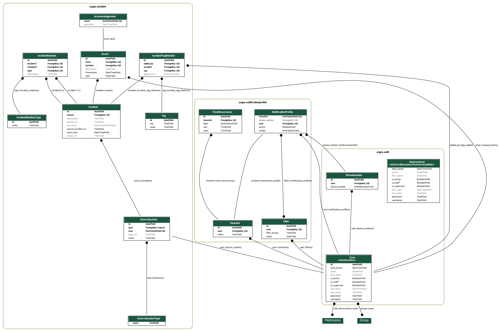

# AAS
[](https://github.com/psf/black)

AAS - Aggregated Alert System is a platform for aggregating alerts across network management systems, and sending notifications to users. Users build notification profiles that define which alerts they subscribe to.

This repository hosts the backend built with Django, while the frontend is hosted here: https://github.com/ddabble/aas-frontend.


## Setup

### Prerequisites
* Python 3.6+
* pip

### Dataporten setup
* Register a new application with the following redirect URL: `{server_url}/complete/dataporten_feide/`
  * `{server_url}` must be replaced with the URL to the server running this project, like `http://localhost:8000`
* Add the following permission scopes:
  * `profile`
  * `userid`
  * `userid-feide`
* Create the text file `src/aas/site/settings/dataporten_secret.txt` containing the client key to the application

### Email setup for production
* Change `EMAIL_HOST_USER` in [`base.py`](/src/aas/site/settings/base.py) to an email address to send notifications from
* Change `EMAIL_HOST` in [`prod.py`](/src/aas/site/settings/prod.py) to match the email's server URL
* Create the text file `src/aas/site/settings/email_secret.txt` containing the password to the email account

*A Gmail account with "Allow less secure apps" turned on, was used in the development of this project.*

### Project setup
* Create a Python 3.6+ virtual environment
* `pip install -r requirements.txt`
* `python manage.py migrate`

Start the server with `python manage.py runserver`.

## Endpoints
*`/admin/` to access the project's admin pages.*

All endpoints require requests to contain a header with key `Authorization` and value `Token {token}`, where `{token}` is replaced by a registered auth token; these are generated per user by logging in through Feide, and can be found at `/admin/authtoken/token/`.

<details>
<summary>Auth endpoints</summary>

* `GET` to `/auth/user/`: returns the logged in user
* `POST` to `/api-token-auth/`: returns an auth token for the posted user
  * Body: `{ username: <username>, password: <password> }`
* `/login/dataporten_feide/`: redirects to Feide login
</details>

<details>
<summary>Alert endpoints</summary>

* `/alerts/`:
  * `GET`: returns all alerts - both active and historic
  * `POST`: creates and returns an alert
    <details>
    <summary>Body:</summary>

    Attribute explanation: https://nav.uninett.no/doc/dev/reference/eventengine.html#exporting-alerts-from-nav-into-other-systems
    ```json
    {
        "id": 212310,
        "history": 196179,
        "time": "2019-11-05T10:03:10.235877",
        "message": "box down example-sw.example.org 10.0.1.42",
        "source": "pping",
        "state": "s",
        "on_maintenance": false,
        "netbox": 138,
        "device_groups": null,
        "device": null,
        "subid": "",
        "subject_type": "Netbox",
        "subject": "example-sw.example.org",
        "subject_url": "/ipdevinfo/example-sw.example.org/",
        "alert_details_url": "/api/alert/196179/",
        "netbox_history_url": "/devicehistory/history/%3Fnetbox=138",
        "event_history_url": "/devicehistory/history/?eventtype=e_boxState",
        "event_type": {
            "description": "Tells us whether a network-unit is down or up.",
            "id": "boxState"
        },
        "alert_type": {
            "description": "Box declared down.",
            "name": "boxDown"
        },
        "severity": 50,
        "value": 100
    }
    ```
    </details>

* `GET` to `/alerts/<int:pk>`: returns an alert by pk
* `GET` to `/alerts/active/`: returns all active alerts
* `PUT` to `/alerts/<int:pk>/active`: changes an alert's active state by pk
  * Body: `{ "active": <bool> }`
* `GET` to `/alerts/metadata/`: returns relevant metadata for all alerts

</details>

<details>
<summary>Notification profile endpoints</summary>

* `/notificationprofiles/`:
  * `GET`: returns the logged in user's notification profiles
  * `POST`: creates and returns a notification profile which is then connected to the logged in user
    <details>
    <summary>Body:</summary>

    ```json
    {
        "time_slot": 1,
        "filters": [
            1,
            2
        ],
        "media": [
            "EM",
            "SM"
        ],
        "active": true
    }
    ```
    </details>

* `/notificationprofiles/<int:pk>`:
  * `GET`: returns one of the logged in user's notification profiles by pk
  * `PUT`: updates and returns one of the logged in user's notification profiles by pk
    * Body: same as `POST` to `/notificationprofiles/`
  * `DELETE`: deletes one of the logged in user's notification profiles by pk

* `GET` to `/notificationprofiles/<int:pk>/alerts/`: returns all alerts - both active and historic - filtered by one of the logged in user's notification profiles by pk

* `/notificationprofiles/timeslots/`:
  * `GET`: returns the logged in user's time slots
  * `POST`: creates and returns a time slot which is then connected to the logged in user
    <details>
    <summary>Body:</summary>

    ```json
    {
        "name": "Weekdays",
        "time_intervals": [
            {
                "day": "MO",
                "start": "08:00:00",
                "end": "16:00:00"
            },
            {
                "day": "TU",
                "start": "08:00:00",
                "end": "16:00:00"
            },
            {
                "day": "WE",
                "start": "08:00:00",
                "end": "16:00:00"
            },
            {
                "day": "TH",
                "start": "08:00:00",
                "end": "16:00:00"
            },
            {
                "day": "FR",
                "start": "08:00:00",
                "end": "16:00:00"
            }
        ]
    }
    ```
    </details>

* `/notificationprofiles/timeslots/<int:pk>`:
  * `GET`: returns one of the logged in user's time slots by pk
  * `PUT`: updates and returns one of the logged in user's time slots by pk
    * Body: same as `POST` to `/notificationprofiles/timeslots/`
  * `DELETE`: deletes one of the logged in user's time slots by pk

* `/notificationprofiles/filters/`:
  * `GET`: returns the logged in user's filters
  * `POST`: creates and returns a filter which is then connected to the logged in user
    <details>
    <summary>Body:</summary>

    ```json
    {
        "name": "Critical alerts",
        "filter_string": "{\"sourceIds\":[<NetworkSystem.pk>, ...], \"objectTypeIds\":[<ObjectType.pk>, ...], \"parentObjectIds\":[<ParentObject.pk>, ...], \"problemTypeIds\":[<ProblemType.pk>, ...]}"
    }
    ```
    </details>

* `/notificationprofiles/filters/<int:pk>`:
  * `GET`: returns one of the logged in user's filters by pk
  * `PUT`: updates and returns one of the logged in user's filters by pk
    * Body: same as `POST` to `/notificationprofiles/filters/`
  * `DELETE`: deletes one of the logged in user's filters by pk

* `POST` to `/notificationprofiles/filterpreview/`: returns all alerts - both active and historic - filtered by the values in the body
  <details>
  <summary>Body:</summary>

  ```json
  {
      "sourceIds": [<NetworkSystem.pk>, ...],
      "objectTypeIds": [<ObjectType.pk>, ...],
      "parentObjectIds": [<ParentObject.pk>, ...],
      "problemTypeIds": [<ProblemType.pk>, ...]
  }
  ```
  </details>

</details>


## Models

### Explanation of terms
* `alert`: a blob of data sent from a network management system to inform about an event in the network.
* `source`: the network management system that the `alert` came from.
* `object`: the most specific object that the `alert` (network event) was about.
* `parent_object`: an object that the `object` is possibly a part of.
* `problem_type`: the type of problem that the `alert` is informing about.
* `active_state`: whether an `alert`'s problem has been resolved.

### ER diagram

